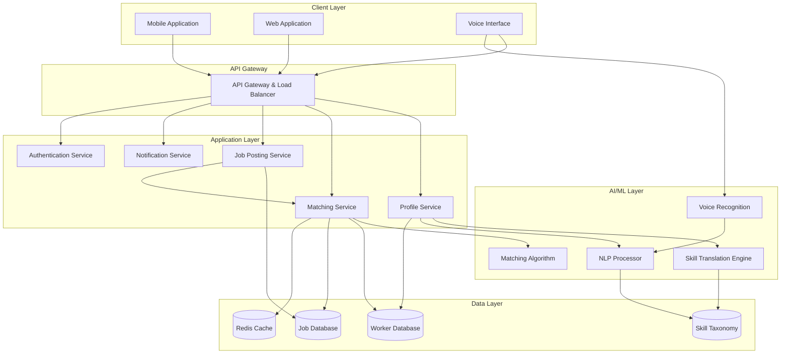

# Design Document: Informal Worker Skill Platform

## Overview

The Informal Worker Skill Platform is an AI-driven system that bridges the gap between skilled informal workers and employment opportunities. The platform addresses the fundamental challenge that millions of workers with strong practical skills remain invisible to formal job markets due to lack of digital identity, resumes, or certifications.

The system consists of three core pillars:

1. **AI-Powered Profile Builder**: Transforms unstructured descriptions of practical skills into standardized digital profiles
2. **Intelligent Matching Engine**: Connects workers to relevant, nearby job opportunities using machine learning
3. **Accessible Interface**: Provides multilingual, voice-enabled, low-literacy support for inclusive access

The platform operates on mobile-first principles, optimized for low-bandwidth environments and devices with limited capabilities, ensuring accessibility for users with varying levels of digital literacy and technological access.

## Architecture

### System Components



### Technology Stack Considerations

- **Mobile Applications**: Cross-platform framework (React Native or Flutter) for iOS and Android
- **Backend Services**: Microservices architecture with RESTful APIs
- **AI/ML**: Natural Language Processing for skill extraction, machine learning for matching
- **Database**: Relational database for structured data, document store for flexible skill profiles
- **Caching**: Redis for frequently accessed data and real-time matching
- **Messaging**: Message queue for asynchronous job matching and notifications
- **Voice Processing**: Speech-to-text API integration for voice input

## Components and Interfaces

### 1. Profile Builder Component

**Purpose**: Converts unstructured worker input into standardized skill profiles.

**Key Interfaces**:

```
interface ProfileBuilder {
  createProfile(workerInput: WorkerInput): SkillProfile
  updateProfile(profileId: string, updates: ProfileUpdate): SkillProfile
  extractSkills(rawText: string, language: string): Skill[]
  translateSkills(skills: Skill[], targetLanguage: string): Skill[]
}

interface WorkerInput {
  rawDescription: string
  language: string
  inputMode: 'text' | 'voice'
  location: GeoLocation
  contactInfo: ContactInfo
}

interface SkillProfile {
  workerId: string
  skills: Skill[]
  experience: Experience[]
  location: GeoLocation
  verificationScore: number
  languages: string[]
  availability: Availability
  createdAt: timestamp
  updatedAt: timestamp
}

interface Skill {
  skillId: string
  name: string
  category: string
  proficiencyLevel: 'beginner' | 'intermediate' | 'expert'
  yearsOfExperience: number
  verified: boolean
}
```

**Skill Translation Process**:

1. **Input Processing**: Receive raw text or voice input in worker's native language
2. **NLP Analysis**: Extract key phrases, action verbs, and domain-specific terminology
3. **Skill Mapping**: Map extracted phrases to standardized skill taxonomy
4. **Disambiguation**: When multiple interpretations exist, request clarification
5. **Profile Generation**: Create structured skill profile with confidence scores

**Skill Taxonomy Structure**:

The system maintains a hierarchical skill taxonomy organized by industry sectors:
- Construction (carpentry, masonry, plumbing, electrical, painting)
- Hospitality (cooking, cleaning, serving, event setup)
- Transportation (driving, delivery, logistics)
- Agriculture (farming, harvesting, animal care)
- Retail (sales, inventory, customer service)
- Maintenance (repair, installation, troubleshooting)
- Care Services (childcare, elderly care, pet care)

Each skill category includes:
- Standardized skill names
- Common synonyms and regional variations
- Related skills and transferable capabilities
- Typical experience indicators

### 2. AI Matching Engine

**Purpose**: Intelligently matches workers to job opportunities based on skills, location, and verification scores.

**Key Interfaces**:

```
interface MatchingEngine {
  findMatchesForJob(jobId: string): WorkerMatch[]
  findJobsForWorker(workerId: string): JobMatch[]
  rankMatches(matches: Match[]): RankedMatch[]
  calculateMatchScore(worker: SkillProfile, job: JobPosting): MatchScore
}

interface JobPosting {
  jobId: string
  employerId: string
  title: string
  description: string
  requiredSkills: SkillRequirement[]
  location: GeoLocation
  maxDistance: number
  duration: JobDuration
  compensation: Compensation
  minVerificationScore: number
  postedAt: timestamp
  expiresAt: timestamp
}

interface SkillRequirement {
  skillId: string
  required: boolean
  minProficiency: 'beginner' | 'intermediate' | 'expert'
  weight: number
}

interface MatchScore {
  overallScore: number
  skillMatchScore: number
  locationScore: number
  verificationScore: number
  availabilityScore: number
  breakdown: ScoreBreakdown
}

interface WorkerMatch {
  workerId: string
  matchScore: MatchScore
  distance: number
  profile: SkillProfile
}
```

**Matching Algorithm**:

The matching algorithm uses a weighted scoring system:

```
MatchScore = (w1 × SkillScore) + (w2 × LocationScore) + (w3 × VerificationScore) + (w4 × AvailabilityScore)

Where:
- w1 = 0.45 (skill match weight)
- w2 = 0.25 (location weight)
- w3 = 0.20 (verification weight)
- w4 = 0.10 (availability weight)
```

**Skill Matching Logic**:
- Exact skill match: 100 points
- Related skill match: 70 points
- Transferable skill match: 40 points
- Proficiency bonus: +20 points if worker exceeds required level
- Experience bonus: +10 points per year of relevant experience (max 50)

**Location Scoring**:
- Within 5km: 100 points
- 5-10km: 80 points
- 10-20km: 60 points
- 20-30km: 40 points
- Beyond max distance: 0 points

### 3. Voice Interface Component

**Purpose**: Enables voice-based interaction for low-literacy users.

**Key Interfaces**:

```
interface VoiceInterface {
  transcribeAudio(audioData: AudioStream, language: string): string
  synthesizeSpeech(text: string, language: string): AudioStream
  detectLanguage(audioData: AudioStream): string
  validateTranscription(transcription: string): ValidationResult
}

interface AudioStream {
  data: Buffer
  format: 'wav' | 'mp3' | 'opus'
  sampleRate: number
  duration: number
}
```

**Voice Processing Flow**:
1. Capture audio input from mobile device
2. Detect spoken language automatically
3. Transcribe speech to text using language-specific models
4. Process text through NLP pipeline
5. Generate voice response for confirmation
6. Allow user to correct or confirm transcription

### 4. Notification Service

**Purpose**: Delivers timely notifications about job matches and employer interest.

**Key Interfaces**:

```
interface NotificationService {
  sendNotification(userId: string, notification: Notification): void
  scheduleNotification(userId: string, notification: Notification, sendAt: timestamp): void
  getNotificationPreferences(userId: string): NotificationPreferences
  updatePreferences(userId: string, preferences: NotificationPreferences): void
}

interface Notification {
  notificationId: string
  type: 'job_match' | 'employer_interest' | 'job_update' | 'verification_update'
  title: string
  message: string
  priority: 'high' | 'medium' | 'low'
  channels: NotificationChannel[]
  data: object
}

interface NotificationChannel {
  type: 'sms' | 'push' | 'in_app'
  enabled: boolean
}

interface NotificationPreferences {
  channels: NotificationChannel[]
  quietHours: TimeRange
  frequency: 'immediate' | 'batched' | 'daily_digest'
}
```

### 5. Verification System

**Purpose**: Builds trust through employer feedback and job completion tracking.

**Key Interfaces**:

```
interface VerificationSystem {
  recordJobCompletion(jobId: string, workerId: string, feedback: Feedback): void
  calculateVerificationScore(workerId: string): number
  getFeedbackHistory(workerId: string): Feedback[]
  detectDuplicateProfiles(profile: SkillProfile): DuplicateCheck
}

interface Feedback {
  feedbackId: string
  jobId: string
  employerId: string
  workerId: string
  rating: number
  completed: boolean
  punctuality: number
  skillQuality: number
  communication: number
  comments: string
  submittedAt: timestamp
}

interface DuplicateCheck {
  isDuplicate: boolean
  confidence: number
  matchingProfiles: string[]
  matchingFactors: string[]
}
```

**Verification Score Calculation**:

```
VerificationScore = BaseScore + CompletionBonus + RatingBonus - PenaltyPoints

Where:
- BaseScore = 50 (starting score for new workers)
- CompletionBonus = NumberOfCompletedJobs × 2 (max 100)
- RatingBonus = AverageRating × 10 (max 50)
- PenaltyPoints = NumberOfCancellations × 5 + NumberOfComplaints × 10
```

Score ranges:
- 0-30: Low trust (flagged for review)
- 31-60: Building trust
- 61-85: Trusted worker
- 86-100: Highly trusted worker

## Data Models

### Worker Profile Schema

```
WorkerProfile {
  workerId: UUID (primary key)
  personalInfo: {
    firstName: string
    lastName: string
    phoneNumber: string (encrypted)
    email: string (optional, encrypted)
    preferredLanguage: string
    profilePhoto: string (URL)
  }
  location: {
    latitude: float
    longitude: float
    city: string
    region: string
    lastUpdated: timestamp
  }
  skills: [
    {
      skillId: UUID
      skillName: string
      category: string
      proficiencyLevel: enum
      yearsOfExperience: integer
      lastUsed: date
      verified: boolean
    }
  ]
  experience: [
    {
      experienceId: UUID
      description: string
      duration: string
      skillsUsed: [UUID]
    }
  ]
  verification: {
    score: integer (0-100)
    jobsCompleted: integer
    averageRating: float
    totalFeedback: integer
    joinedDate: timestamp
  }
  availability: {
    status: enum ('available', 'busy', 'inactive')
    schedule: object
    maxDistance: integer (km)
  }
  preferences: {
    notificationSettings: object
    privacySettings: object
    jobPreferences: object
  }
  metadata: {
    createdAt: timestamp
    updatedAt: timestamp
    lastActive: timestamp
    profileCompleteness: integer (percentage)
  }
}
```

### Job Posting Schema

```
JobPosting {
  jobId: UUID (primary key)
  employerId: UUID (foreign key)
  jobDetails: {
    title: string
    description: string
    category: string
    duration: {
      type: enum ('one_time', 'recurring', 'full_time')
      startDate: date
      endDate: date (optional)
      hoursPerWeek: integer (optional)
    }
    compensation: {
      amount: float
      currency: string
      type: enum ('hourly', 'daily', 'project')
    }
  }
  requirements: {
    skills: [
      {
        skillId: UUID
        required: boolean
        minProficiency: enum
        weight: float
      }
    ]
    minVerificationScore: integer
    experienceRequired: boolean
  }
  location: {
    latitude: float
    longitude: float
    address: string
    maxDistance: integer (km)
  }
  status: {
    state: enum ('open', 'in_progress', 'filled', 'cancelled', 'expired')
    postedAt: timestamp
    expiresAt: timestamp
    filledAt: timestamp (optional)
    selectedWorkerId: UUID (optional)
  }
  matching: {
    autoMatch: boolean
    maxCandidates: integer
    matchedWorkers: [UUID]
    interestedWorkers: [UUID]
  }
  metadata: {
    views: integer
    applications: integer
    createdAt: timestamp
    updatedAt: timestamp
  }
}
```

### Skill Taxonomy Schema

```
SkillTaxonomy {
  skillId: UUID (primary key)
  standardName: string
  category: string
  subcategory: string
  synonyms: [
    {
      term: string
      language: string
      confidence: float
    }
  ]
  relatedSkills: [
    {
      skillId: UUID
      relationship: enum ('similar', 'prerequisite', 'advanced', 'complementary')
      strength: float
    }
  ]
  metadata: {
    usageCount: integer
    lastUpdated: timestamp
    verifiedBy: string
  }
}
```

## Correctness Properties

*A property is a characteristic or behavior that should hold true across all valid executions of a system—essentially, a formal statement about what the system should do. Properties serve as the bridge between human-readable specifications and machine-verifiable correctness guarantees.*


### Profile Creation Properties

Property 1: Profile generation from worker input
*For any* worker input containing skill descriptions, the Profile_Builder should create a valid Skill_Profile with at least one standardized skill category from the taxonomy.
**Validates: Requirements 1.1**

Property 2: Skill translation consistency
*For any* skill in the taxonomy, translating it to a supported language and then categorizing it back should result in the same or equivalent skill category.
**Validates: Requirements 1.2**

Property 3: Profile storage and retrieval
*For any* created Skill_Profile, storing it and then searching for it by worker ID should return an equivalent profile with all core fields preserved.
**Validates: Requirements 1.4**

Property 4: Skill extraction completeness
*For any* unstructured input containing known skill keywords from the taxonomy, the Profile_Builder should extract at least those skills that are explicitly mentioned.
**Validates: Requirements 1.5**

### Multilingual Support Properties

Property 5: Language consistency across UI
*For any* supported language selection, all interface elements in the response should be in the selected language (no mixed-language content).
**Validates: Requirements 2.1**

Property 6: Voice transcription accuracy threshold
*For any* voice input in a supported language, the transcription accuracy should meet or exceed 85% word-level accuracy for clear audio.
**Validates: Requirements 2.2**

### Job Matching Properties

Property 7: Skill-based worker filtering
*For any* job posting with required skills, all matched workers should possess at least one of the required skills in their profile.
**Validates: Requirements 3.1**

Property 8: Distance-based match prioritization
*For any* worker and set of job postings at different distances, jobs closer to the worker should have higher location scores than jobs farther away.
**Validates: Requirements 3.2**

Property 9: Match ranking consistency
*For any* job posting with multiple matching workers, workers with higher combined skill relevance and verification scores should rank higher than those with lower scores.
**Validates: Requirements 3.3**

Property 10: Profile update triggers re-matching
*For any* worker profile where new skills are added that match existing job postings, the worker should receive new job match notifications after the update.
**Validates: Requirements 3.4**

Property 11: Transferable skills inclusion
*For any* job posting requiring a specific skill, workers with either exact matches or transferable skills (as defined in the taxonomy) should be included in the match results.
**Validates: Requirements 3.5**

### Job Posting Properties

Property 12: Required field validation
*For any* job posting submission missing required fields (skills, location, or duration), the Platform should reject the submission and return a validation error.
**Validates: Requirements 4.1, 4.2**

Property 13: Automatic matching trigger
*For any* valid job posting creation, the AI_Matcher should execute and return at least an empty match result set (indicating matching was attempted).
**Validates: Requirements 4.3**

Property 14: Worker display completeness
*For any* matched worker displayed to an employer, the rendered output should contain the worker's skill profile, verification score, and distance from job location.
**Validates: Requirements 4.5**

### Verification Properties

Property 15: Verification score updates
*For any* worker with an initial verification score, adding employer feedback should result in a different verification score calculated according to the scoring formula.
**Validates: Requirements 5.2**

Property 16: Job history accuracy
*For any* worker who has completed jobs, the displayed average rating should equal the arithmetic mean of all received ratings, and the job count should match the number of completed jobs.
**Validates: Requirements 5.3**

Property 17: Duplicate profile detection
*For any* attempt to create a new worker profile with a phone number that already exists in the system, the Platform should detect it as a duplicate and prevent creation.
**Validates: Requirements 5.4**

### Location-Based Discovery Properties

Property 18: Location-based filtering and distance calculation
*For any* employer search with a maximum distance radius, all returned workers should be within that radius, and each result should include an accurate distance calculation.
**Validates: Requirements 6.1, 6.2**

Property 19: Location update propagation
*For any* worker location update that moves them outside the radius of previously matched jobs, those job matches should be removed or re-ranked in subsequent match queries.
**Validates: Requirements 6.4**

Property 20: Address privacy protection
*For any* worker profile accessed by an employer without an established job connection, the exact address fields should be null or redacted in the response.
**Validates: Requirements 6.5**

### Skill Translation Properties

Property 21: Synonym mapping consistency
*For any* skill synonym or regional terminology in the taxonomy, the Profile_Builder should map it to the correct standardized skill category consistently across all inputs.
**Validates: Requirements 7.1, 7.2**

Property 22: Ambiguity handling
*For any* skill description that matches multiple skill categories with similar confidence scores (within 10% of each other), the Profile_Builder should return a clarification request rather than auto-selecting.
**Validates: Requirements 7.4**

### Notification Properties

Property 23: Match notification timeliness
*For any* new worker-job match created, a notification should be queued or sent to the worker within 5 minutes of match creation.
**Validates: Requirements 8.1**

Property 24: Interest notification trigger
*For any* employer interest event on a worker profile, a notification should be created and sent to that worker immediately.
**Validates: Requirements 8.3**

### Privacy and Security Properties

Property 25: Personal information encryption
*For any* worker personal information (phone, email, address) stored in the database, it should be encrypted using the platform's encryption standard.
**Validates: Requirements 9.1**

Property 26: Consent-based information sharing
*For any* request for worker contact information without mutual consent flags set, the Platform should deny access and return an authorization error.
**Validates: Requirements 9.2**

Property 27: Account deletion data removal
*For any* worker account deletion request, all personal information should be marked for deletion and removed from active databases within 30 days.
**Validates: Requirements 9.4**

### Performance and Accessibility Properties

Property 28: Data usage optimization
*For any* content response containing images, the total payload size should be reduced by at least 40% compared to uncompressed originals through compression and format optimization.
**Validates: Requirements 10.2**

Property 29: Offline data availability
*For any* essential data (worker profile, active job matches) accessed while online, that data should be available in local cache when the device goes offline.
**Validates: Requirements 10.4**

## Error Handling

### Error Categories

The platform implements comprehensive error handling across four categories:

**1. Input Validation Errors**
- Invalid or incomplete profile data
- Missing required fields in job postings
- Malformed location coordinates
- Unsupported language codes

**2. Business Logic Errors**
- Duplicate profile creation attempts
- Unauthorized access to worker contact information
- Job posting by unverified employers
- Match requests for expired job postings

**3. External Service Errors**
- Voice recognition API failures
- SMS notification delivery failures
- Geocoding service unavailability
- Payment processing errors

**4. System Errors**
- Database connection failures
- Cache unavailability
- Service timeout errors
- Resource exhaustion

### Error Response Format

All errors follow a consistent structure:

```
ErrorResponse {
  errorCode: string
  errorMessage: string
  errorDetails: object
  timestamp: timestamp
  requestId: string
  userMessage: string (localized)
  retryable: boolean
}
```

### Error Handling Strategies

**Graceful Degradation**:
- When voice recognition fails, fall back to text input
- When real-time matching is slow, return cached results with staleness indicator
- When notifications fail, queue for retry with exponential backoff

**User-Friendly Messages**:
- All error messages are localized to the user's preferred language
- Technical details are logged but not exposed to end users
- Actionable guidance is provided (e.g., "Please check your internet connection")

**Retry Logic**:
- Transient errors (network, timeout) are automatically retried up to 3 times
- Exponential backoff prevents overwhelming failing services
- Non-retryable errors (validation, authorization) fail immediately

**Monitoring and Alerting**:
- All errors are logged with context for debugging
- Critical errors trigger alerts to operations team
- Error rates are monitored for anomaly detection

## Testing Strategy

### Dual Testing Approach

The platform requires both unit testing and property-based testing for comprehensive coverage:

**Unit Tests**: Focus on specific examples, edge cases, and error conditions
- Test specific skill translation examples (e.g., "plomero" → "plumber")
- Test edge cases like empty profiles, zero-distance matches
- Test error conditions like invalid coordinates, missing required fields
- Test integration points between services
- Verify specific business rules (e.g., verification score calculation with known inputs)

**Property-Based Tests**: Verify universal properties across all inputs
- Generate random worker profiles and verify structure validity
- Generate random job postings and verify matching logic
- Test skill translation across all taxonomy entries
- Verify ranking consistency across random worker sets
- Test encryption is applied to all personal data fields

### Property-Based Testing Configuration

**Framework Selection**:
- Python: Use Hypothesis library
- TypeScript/JavaScript: Use fast-check library
- Java: Use jqwik library

**Test Configuration**:
- Minimum 100 iterations per property test (due to randomization)
- Each property test must reference its design document property
- Tag format: `Feature: informal-worker-skill-platform, Property {number}: {property_text}`
- Use shrinking to find minimal failing examples

**Example Property Test Structure**:

```python
# Feature: informal-worker-skill-platform, Property 1: Profile generation from worker input
@given(worker_input=worker_input_strategy())
@settings(max_examples=100)
def test_profile_generation_from_worker_input(worker_input):
    profile = profile_builder.create_profile(worker_input)
    
    assert profile is not None
    assert len(profile.skills) > 0
    assert all(skill.category in SKILL_TAXONOMY for skill in profile.skills)
```

### Test Data Strategies

**Generators for Property Tests**:
- Worker profiles with random skills, locations, and experience levels
- Job postings with random skill requirements and locations
- Skill descriptions in multiple languages
- Location coordinates within valid geographic bounds
- Verification scores across the full 0-100 range
- Feedback ratings with various combinations of scores

**Edge Cases to Cover**:
- Empty or whitespace-only input
- Maximum field lengths
- Boundary values (0 distance, 100 verification score)
- Unsupported languages
- Invalid coordinates
- Expired timestamps

### Integration Testing

**Service Integration Tests**:
- Test Profile Service → Matching Service flow
- Test Job Service → Notification Service flow
- Test Voice Interface → NLP Processor → Profile Builder flow
- Test end-to-end worker registration and job matching

**External Service Mocking**:
- Mock voice recognition APIs with predictable responses
- Mock SMS gateways for notification testing
- Mock geocoding services for location testing
- Use test databases for data layer testing

### Performance Testing

**Load Testing Scenarios**:
- 1000 concurrent worker profile creations
- 10,000 job matches per minute
- 5000 simultaneous voice transcriptions
- Database query performance under load

**Performance Targets**:
- Profile creation: < 2 seconds
- Job matching: < 3 seconds for 10,000 worker pool
- Voice transcription: < 5 seconds for 30-second audio
- Notification delivery: < 5 minutes (as per requirements)

### Accessibility Testing

**Manual Testing Requirements**:
- Test voice interface with actual users
- Verify screen reader compatibility
- Test on low-end devices (< 2GB RAM)
- Test on slow networks (2G/3G)
- Verify multilingual content displays correctly

**Automated Accessibility Tests**:
- Verify all images have alt text
- Check color contrast ratios
- Validate semantic HTML structure
- Test keyboard navigation
- Verify ARIA labels are present

## Implementation Notes

### Phased Rollout Strategy

**Phase 1: Core Platform (MVP)**
- Worker profile creation with basic skill translation
- Job posting and manual matching
- Single language support (pilot region)
- SMS notifications only
- Basic verification system

**Phase 2: AI Enhancement**
- Automated AI matching engine
- Multi-language support (5 languages)
- Voice interface integration
- Advanced skill taxonomy with synonyms
- Push notifications

**Phase 3: Scale and Optimization**
- Performance optimization for large user base
- Advanced duplicate detection
- Machine learning model improvements
- Additional language support
- Analytics and insights dashboard

### Technology Recommendations

**Backend**:
- Microservices architecture for scalability
- RESTful APIs with GraphQL for complex queries
- Message queue (RabbitMQ/Kafka) for async processing
- Redis for caching and real-time matching

**AI/ML**:
- Pre-trained multilingual NLP models (mBERT, XLM-R)
- Custom skill classification model fine-tuned on informal work domain
- Voice recognition via cloud APIs (Google Speech-to-Text, Azure Speech)
- Continuous learning pipeline for skill taxonomy updates

**Mobile**:
- Cross-platform framework (React Native or Flutter)
- Offline-first architecture with local SQLite cache
- Progressive Web App (PWA) for web access
- Image compression and lazy loading

**Database**:
- PostgreSQL for relational data (workers, jobs, feedback)
- MongoDB for flexible skill profiles
- PostGIS extension for geospatial queries
- Regular backups and point-in-time recovery

### Security Considerations

**Authentication**:
- Phone number-based authentication with OTP
- JWT tokens for session management
- Refresh token rotation
- Rate limiting on authentication endpoints

**Data Protection**:
- AES-256 encryption for data at rest
- TLS 1.3 for data in transit
- Field-level encryption for sensitive data (phone, email)
- Regular security audits and penetration testing

**Privacy**:
- GDPR and local data protection compliance
- User consent management
- Data minimization principles
- Right to be forgotten implementation

### Monitoring and Observability

**Metrics to Track**:
- Profile creation success rate
- Matching accuracy and relevance
- Notification delivery rate
- API response times
- Error rates by category
- User engagement metrics

**Logging**:
- Structured logging with correlation IDs
- Log aggregation and search (ELK stack)
- Sensitive data redaction in logs
- Log retention policies

**Alerting**:
- Service health checks
- Error rate thresholds
- Performance degradation alerts
- Security incident detection
